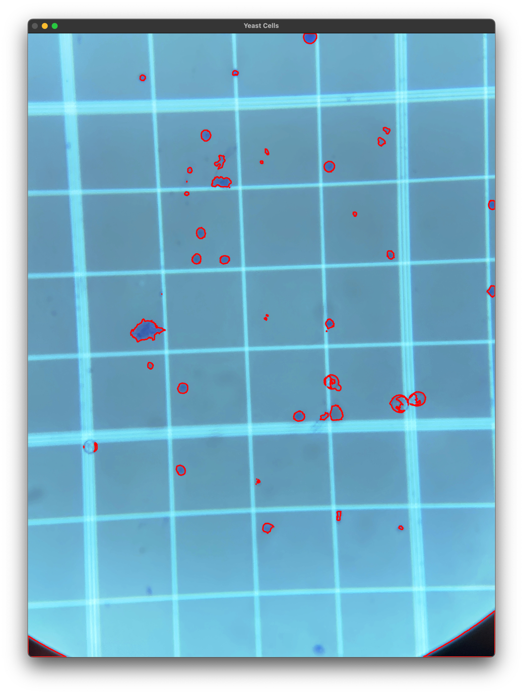

# Pyrmont Brewery -Yeast Viability Detector

Count viable cells on a Haemacytometer slide using Raspbeery Pi cheap microsope 
lens (Ali epxress) and a bright LED light source

Yeast sample is dyed with Methylene blue

](pyrmont_brewery_raspberrypi_microscope.png)

Last run test results...
